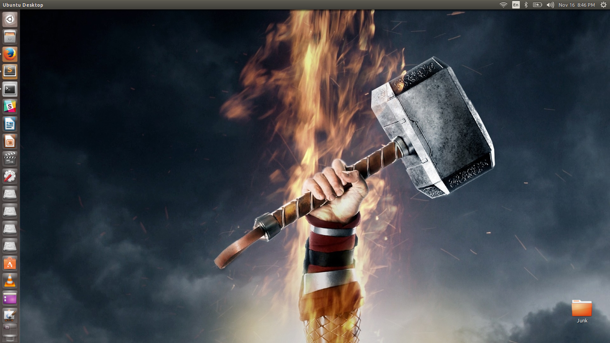

UIP Is Pretty
=============

UIP Scrapes wallpapers from reddit and applies them as wallpapers on a
gnome Desktop according to a schedule.

Set Up
======

To install the requirements first run the command

```
sudo pip install -r requirements.txt
```
if you're on a mac, you would need to also run this command
```
sudo pip install -r mac-requirements.txt
```
if you're on a linux system you would need to install
pygobject, to install on debian use:
```
sudo apt-get install python3-gi
```

Run
===

To run the command cd into the project folder and type:

```
python3 UIP.py
```
Contact Us
==========
https://gitter.im/NIT-dgp/General


Screenshot
==========




HOW TO CONTRIBUTE
=================

UIP is in its very early development stage, you can go over the issues on the 
github issues page and send in a PR.

your commits in the PR should be of the form:

```
shortlog: commit message

commit body
Fixes <issue number>
```

UIP uses coala as a linter, to install use:
```
sudo pip install coala
```

before you push remember to run
```
coala
```
and commit all changes suggested

where short log is the area/filename where you make the change
commit message is the very brief description of the change made by you and any
other additional details go into the commit body.

Do remember to keep your master branch updated at all times
and always work on a different branch.

Happy coding :)
